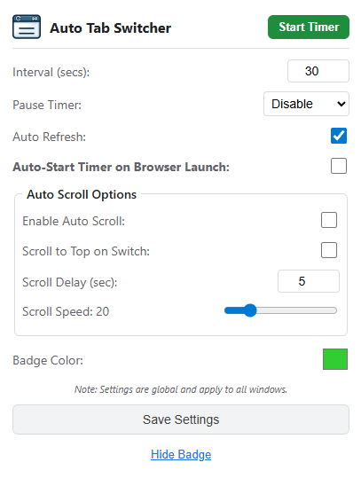

# Auto Tab Switcher Extension

This extension automatically switches between your open tabs at an interval you set, and it can even refresh them for you. It's designed to only work in the window where you start it, so you can keep using other windows without any interruptions. This can be great for dashboards, monitoring tools, or presentations where you need to cycle through different information displays. Since **Revolver - Tabs** is no longer available, this plugin acts as a functional alternative.

**Compatibility:** Since it's built for Chrome, it works with all Chromium-based browsers like **Google Chrome**, **Microsoft Edge**, **Brave**, **Vivaldi**, and **Opera**.

This project is forked from [ethanwa/ChromeAutoTabSwitcherExtension](https://github.com/ethanwa/ChromeAutoTabSwitcherExtension).

  

## Features

- **Auto Tab Switching:** Cycles through all open tabs in the window.
- **Auto Refresh:** Optional setting to refresh the tab immediately after switching to it.
- **Window Isolation:** Works only on the window where it was activated.
- **Auto Scroll:** Automatically scrolls down the page at a configurable speed.
- **Pause Modes:** Configurable options to pause the timer on user activity or when hovering over the page.
- **Auto-Start:** Automatically starts the timer when the browser opens or a new window is created.
- **Customizable Interval:** Set the switching time in seconds.
- **Visual Countdown:** Shows a countdown badge on the extension icon.
- **Customizable Badge:** Change the color of the badge or hide it completely.

## Usage

1.  **Configure Settings:**
    - Open the extension popup.
    - Set the **Interval** in seconds (minimum 5).
    - Select **Pause Timer** mode: Disable, On Activity, or On Hover.
    - Toggle **Auto Refresh** if desired.
    - Toggle **Auto-Start Timer on Browser Launch** if desired (also applies to new windows).
    - **Auto Scroll Options:**
        - Toggle **Enable Auto Scroll** to start scrolling automatically.
        - Toggle **Scroll to Top on Switch** to reset scroll position when switching tabs.
        - Set **Scroll Delay** (seconds) to wait before scrolling starts.
        - Adjust **Scroll Speed** slider (1-100).
    - Choose a **Badge Color**.
    - Click **Save Settings**.

2.  **Control Timer:**
    - Click **Start Timer** to begin rotating through the current open tabs. The button will turn red to indicate the timer is running.
    - Click **Stop Timer** to stop the tabs from switching.

3.  **Badge Visibility:**
    - Click the **Hide/Show Badge** button to toggle the countdown display.

## Installation (From Source)

1.  Clone this repository.
2.  Open Chrome and go to `chrome://extensions`.
3.  Enable **Developer mode**.
4.  Click **Load unpacked** and select the extension folder.

## License

Distributed under the MIT License. See `LICENSE.md` for more information.
